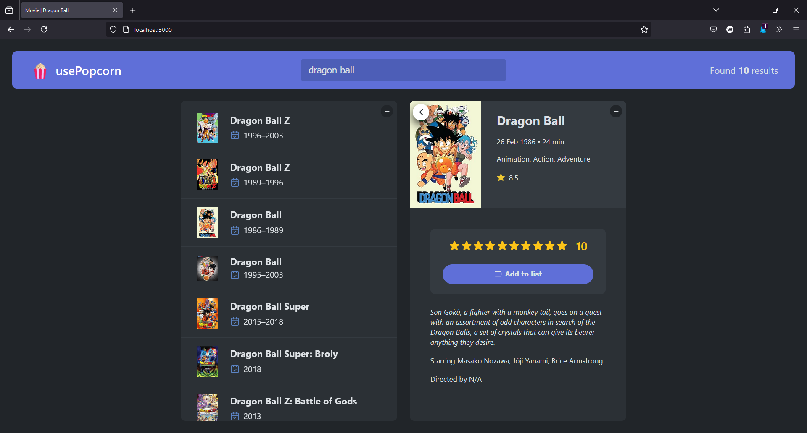
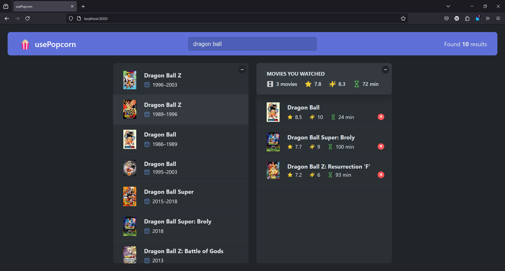
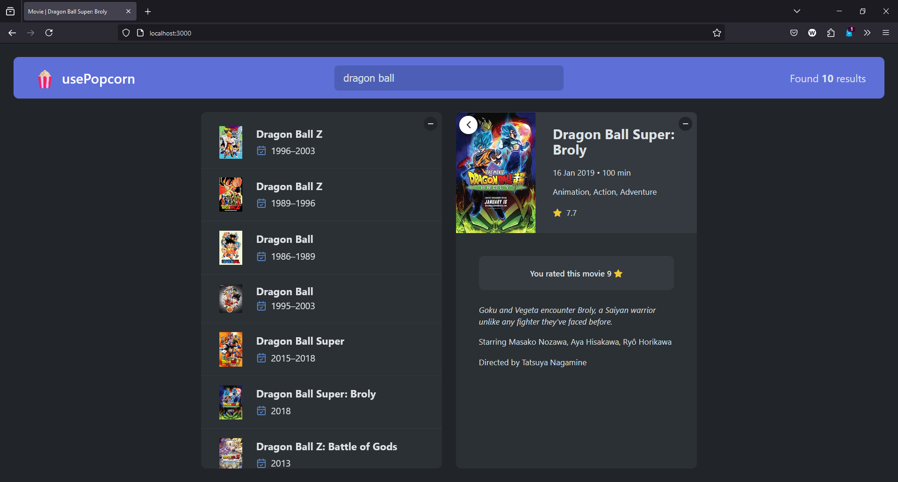

# 🍿 usePopcorn

**usePopcorn** é uma aplicação web para explorar filmes, buscar títulos e organizar sua lista de filmes assistidos. O projeto utiliza a API da OMDb para fornecer informações atualizadas sobre os filmes de forma rápida e prática.



---

## 🎬 Funcionalidades

- Buscar filmes por título utilizando a API da OMDb
- Visualizar detalhes de cada filme
- Adicionar filmes a uma lista de "Assistidos"
- Avaliar os filmes assistidos com uma nota personalizada
- Interface simples, responsiva e fácil de usar

---

## 🛠️ Tecnologias Utilizadas

- **React** – Biblioteca principal para a construção da interface
- **JavaScript (ES6+)** – Lógica da aplicação
- **OMDb API** – Fonte dos dados dos filmes
- **CSS** – Estilização responsiva
- **Git & GitHub** – Versionamento de código

---

## 📸 Screenshots

<p float="left">
  
  
  
</p>

---

## 🚀 Como rodar localmente

```bash
# Clone o repositório
git clone https://github.com/WalysonGomes/usePopcorn.git

# Acesse a pasta do projeto
cd usePopcorn

# Instale as dependências
npm install

# Inicie o servidor de desenvolvimento
npm run dev
